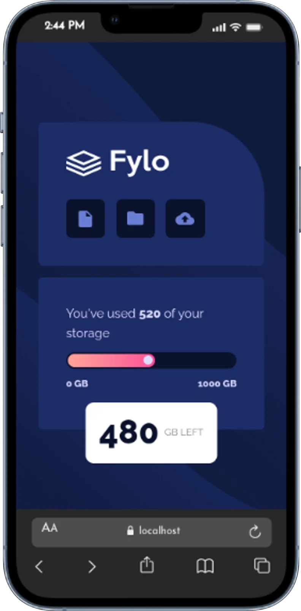
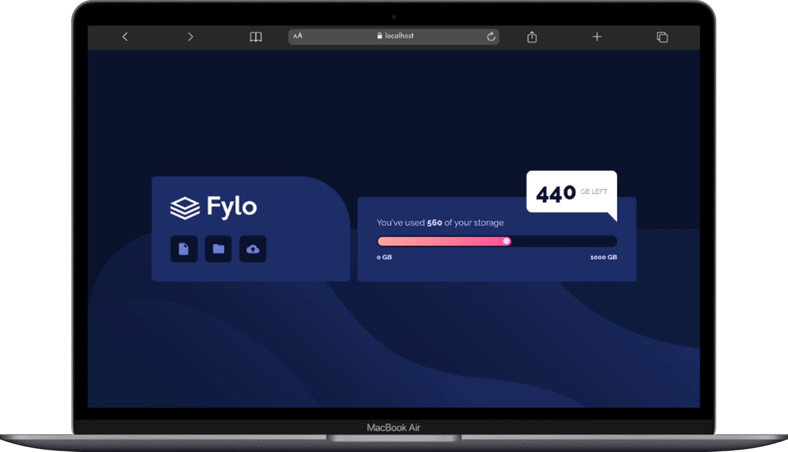

# Frontend Mentor - Fylo data storage component solution

This is a solution to the [Fylo data storage component challenge on Frontend Mentor](https://www.frontendmentor.io/challenges/fylo-data-storage-component-1dZPRbV5n). Frontend Mentor challenges help you improve your coding skills by building realistic projects.

## Table of contents

- [Overview](#overview)
  - [The Challenge](#the-challenge)
  - [Screenshot](#screenshot)
  - [Links](#links)
- [Built with](#built-with)
- [Getting Started](#getting-started)
  - [Prerequisites](#prerequisites)
  - [Development Build](#development-build)
  - [Production Build](#production-build)
- [Author](#author)
- [AI Collaboration](#ai-collaboration)
- [License](#license)

## Overview

### The Challenge

Users should be able to:

- View the optimal layout for the site depending on their device's screen size

### Screenshot

Target Build:

- General Overview
  

Solution Built:

- Mobile View:
  

- Desktop View:
  

### Links

- Solution URL: [GitHub Source Code](https://github.com/TonyFred-code/fylo-data-storage/)
- Live Site URL: [Vercel Deployed Demo](https://fylo-data-storage-theta-three.vercel.app/)

## Built with

- Semantic HTML5 markup
- Mobile-first workflow
- [React](https://reactjs.org/) - JS library
- [TailwindCSS](https://tailwindcss.com/) - CSS framework
- [Vite](https://vite.dev/) - Build Tool

## Getting Started

### Prerequisites

Node.js (v18+ recommended)
Git

### Development Build

To run this project locally, follow these steps:

- Clone your fork of the repository:

```bash
git clone https://github.com/yourusername/fylo-data-storage.git
```

- Navigate to the project directory

```bash
cd fylo-data-storage
```

- Install dependencies

```bash
npm install
```

- Start the development server

```bash
npm run dev
```

The app will be available at: `http://localhost:5173`

### Production Build

```bash
npm run build
npm run preview
```

## Author

- Personal Website - [alfred.code](https://alfredfaith.me)
- Frontend Mentor - [@TonyFred-code](https://www.frontendmentor.io/profile/TonyFred-code)
- X (previously Twitter) - [@alfredfaith35](https://www.x.com/alfredfaith35)

## AI Collaboration

Work with `Claude` as described in [AGENTS Collaboration Specification](./AGENTS.md) file

## License

This project is licensed under the MIT License.
See the [LICENSE](./LICENSE) file for more details.
